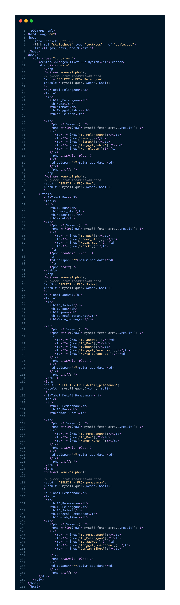
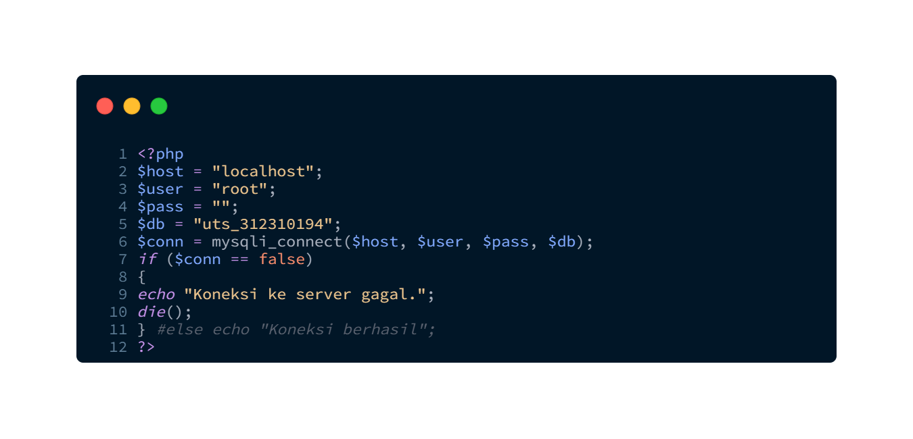
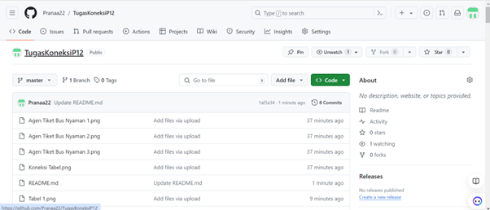

# Authors
Pranaja Widyadhana Wardana  
Teknik Informatika 23.A2  
Universitas Pelita Bangsa

# Tugas Koneksi Mysql
Tugas basis Data  
Pertemuan 12 Semester 2

# 1. Menggunakan data yang dibuat dari soal Uts kemarin.

# 2. Buat koneksi dengan php.

# 3. Tampilkan data tabelnya masing2.

# 4. Buat repo di github dengan judul tugas koneksi

# 5. Contoh
->
https://github.com/codeaflaha/Sistem-Basis-Data-19.B1

# 6. Contoh
->
https://github.com/wahyudiprabowo311910218/tugas-8-SBD-19.B1

# 7. Kumpulkan di ecampus waktu : Jum'at - 14 Juni - 2024
